## What is a digital service?

- it's usually a website
- it helps people achieve a goal
- some just contain information (static websites)
- some let you perform tasks (dynamic websites)

::: notes
some are apps (gov.uk id, gov.uk wallet, HMRC app)
some might just be APIs, not sure if these are _services_
:::

## What is a website?

- a collection of pages written in HTML
- some websites have forms that collect data
- accessible via a domain, e.g. https://www.gov.uk
- runs on a web server and is accessed by a client (your browser)

---

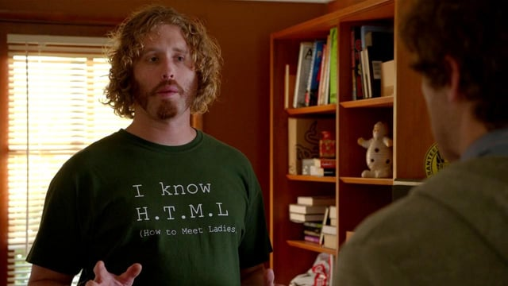{height=200}

## It's just text

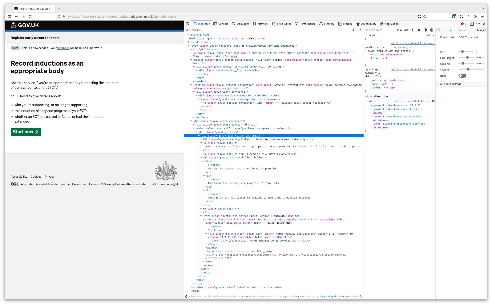{height=250}

## A sample HTML document

```html
<html lang="en">
  <head>
    <title>My new service</title>
  </head>
  <body>
    <h1>My new service</h1>

    <p>
      Lorem ipsum dolor sit amet, consectetur
      adipiscing elit. Proin sit amet.
    </p>
  </body>
</html>
```

---

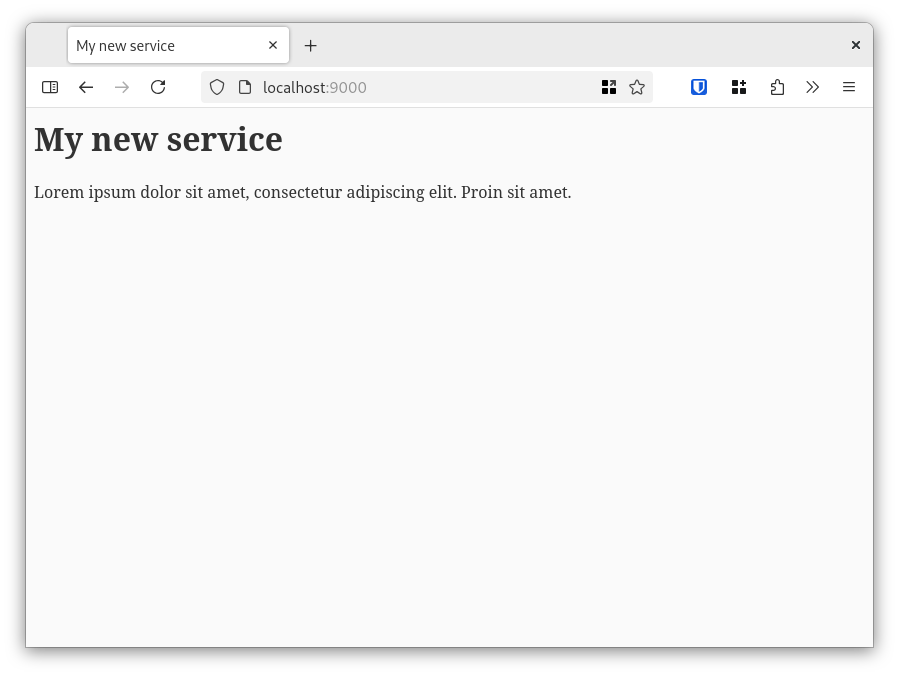{height=250}

## Making text pretty with stylesheets

```diff
 <html lang="en">
   <head>
     <title>My new service</title>
+    <link rel="stylesheet" href="style.css">
   </head>
   <body>
     <h1>My new service</h1>
 
     <p>
       Lorem ipsum dolor sit amet, consectetur
       adipiscing elit. Proin sit amet.
     </p>
   </body>
 </html>
```

---

```css
h1 {
  color: white;
  background: black;
}

h1::before {
  content: "👑 ";
}

```

---

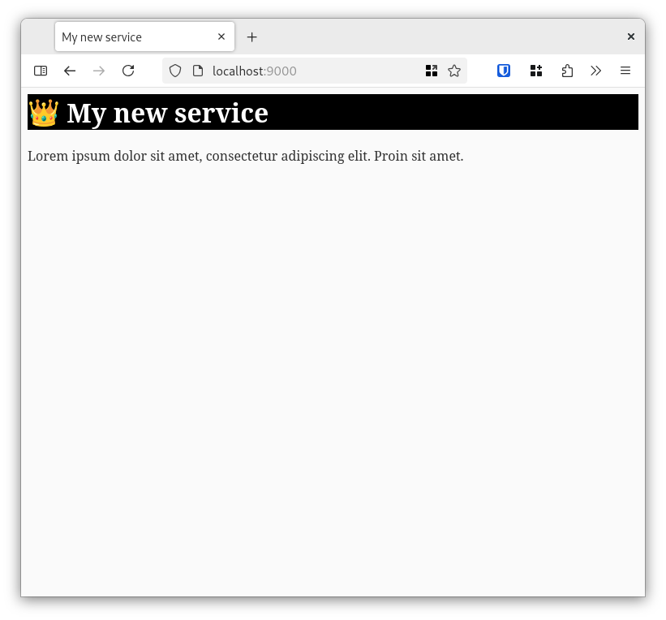{height=250}

---

## Digital services at DfE

- there's a clear objective, like _registering for a teacher training adviser_
- in order to reach that goal, we (usually) need to collect some data
- we ask for that data using forms
- we record the answers in a database
- along the way, we might need to talk to other services

--- 

## How we write them (in Teacher Services)

Most services in Teacher Services:

- are written in Ruby on Rails
- save their data in a database called PostgreSQL
- are hosted in Azure
- talk to other services using APIs

---

{height=250}


::: notes
use Rails template
create a scaffold
CSS
replace the generated HTML with GOV.UK components
talk about gems (shared libraries that help us build things faster)
show some validation
show the database table after we've written a record
:::

# We have a service, now what?

## It lives on Azure

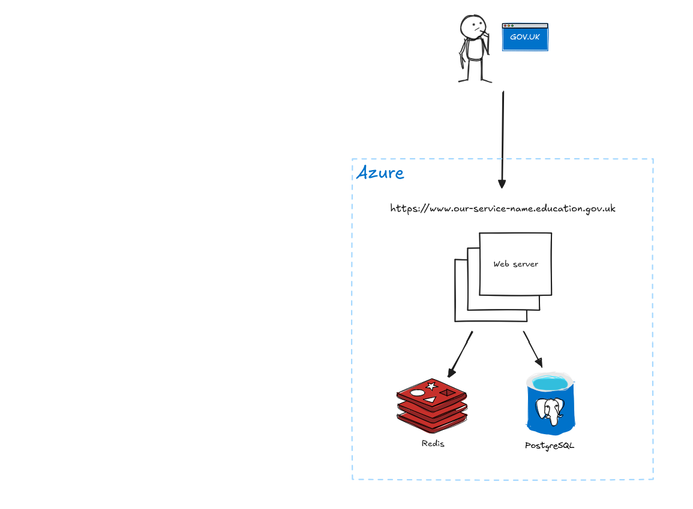{height=250}

::: notes
in reality there are a few more moving parts; workers, caches, queues, etc
:::

## Our code lives on GitHub

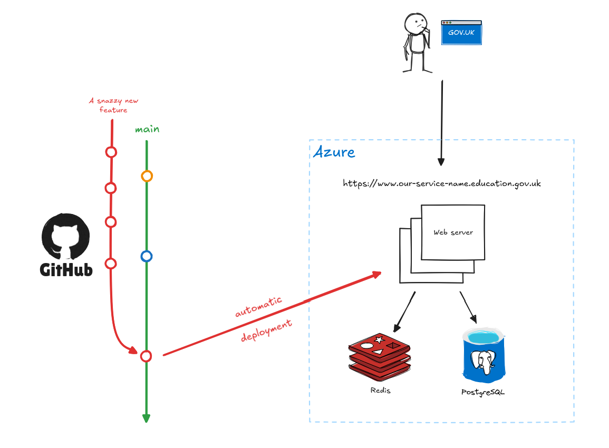{height=250}

---

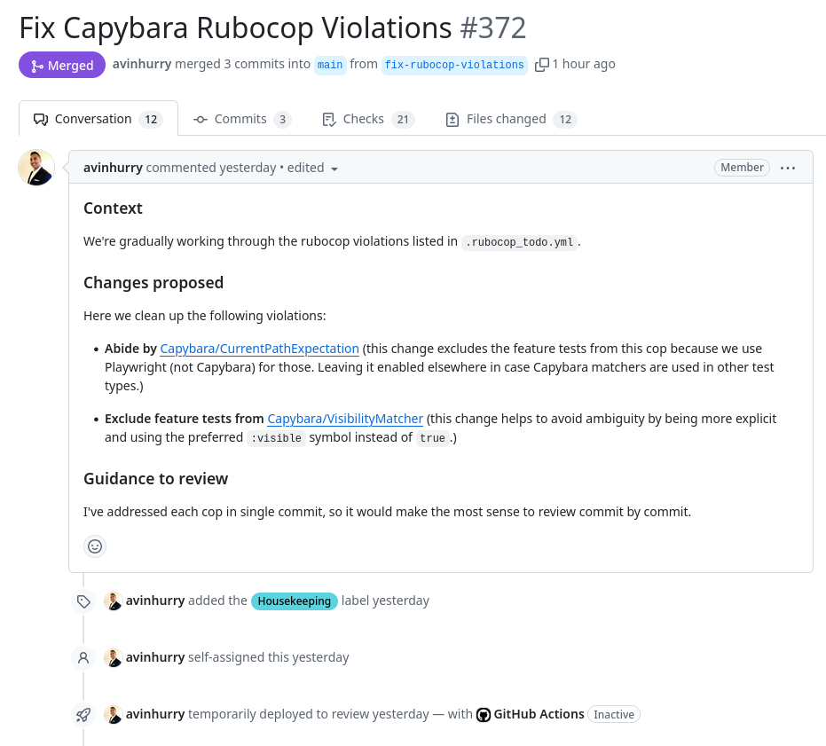{height=250}

---

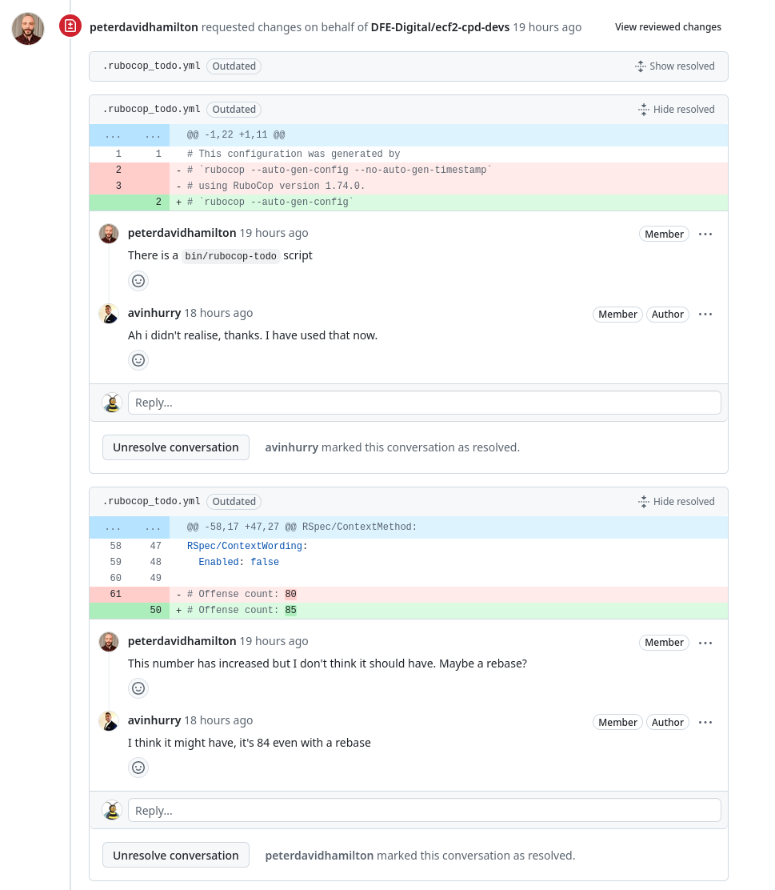{height=250}

---

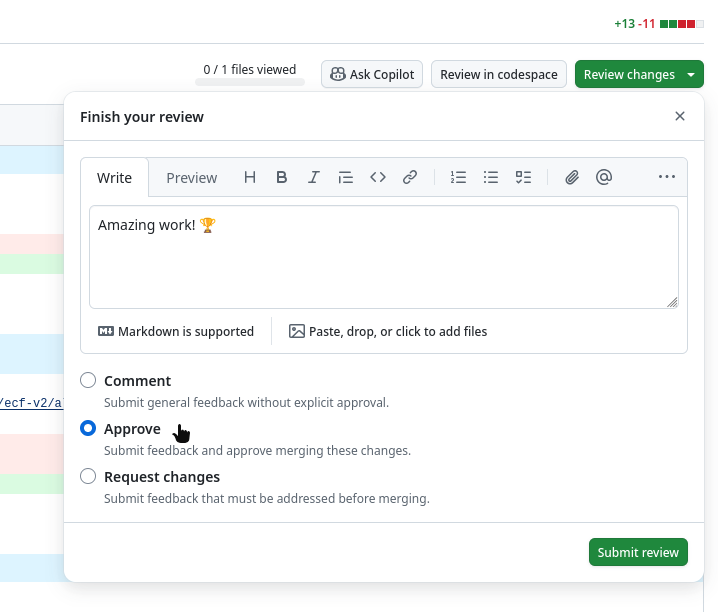{height=250}

---

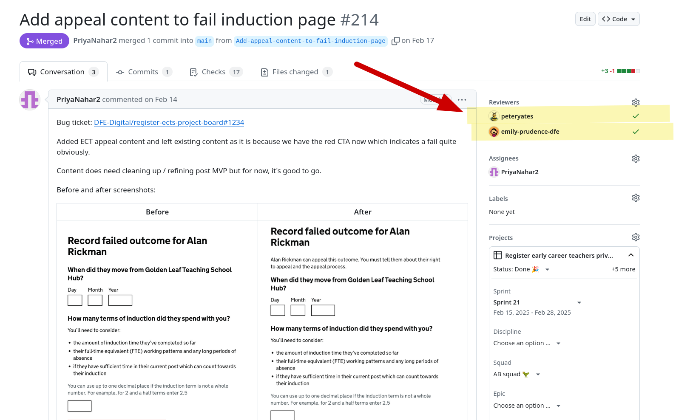{height=250}

---

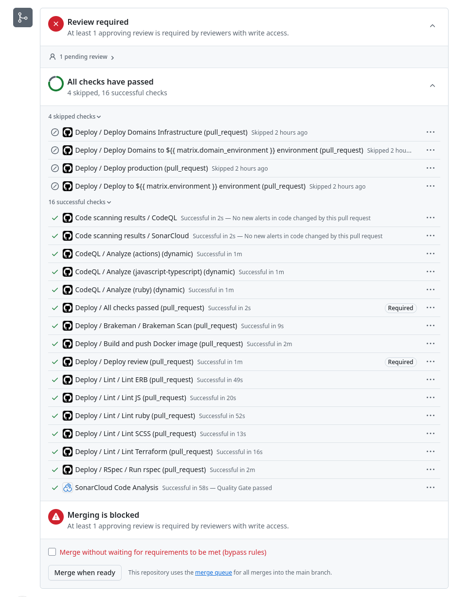{height=250}


---

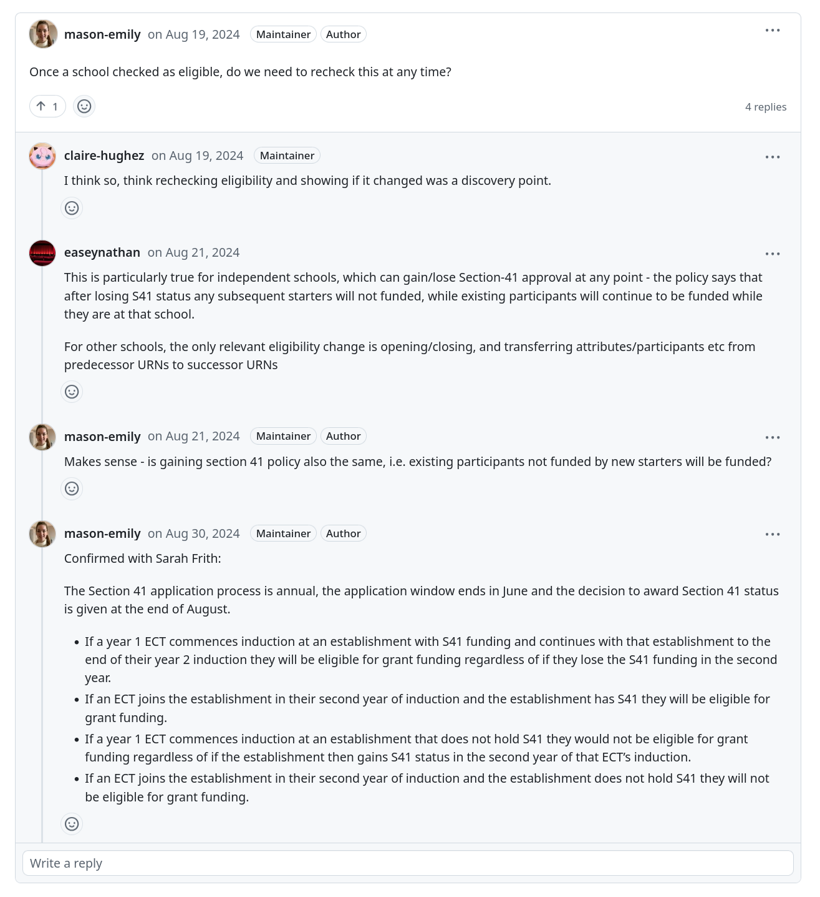{height=250}

---

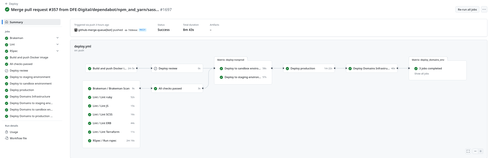{height=300}

